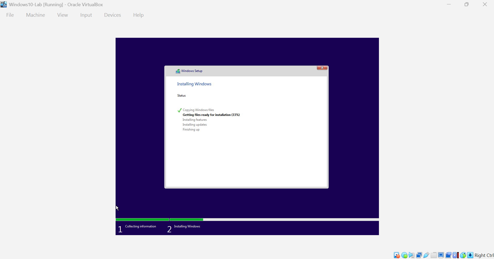
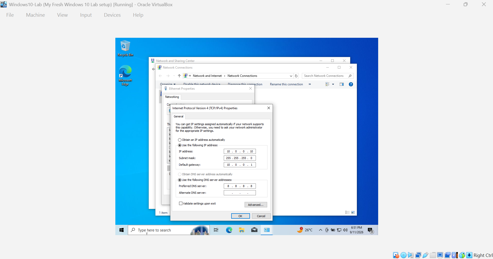
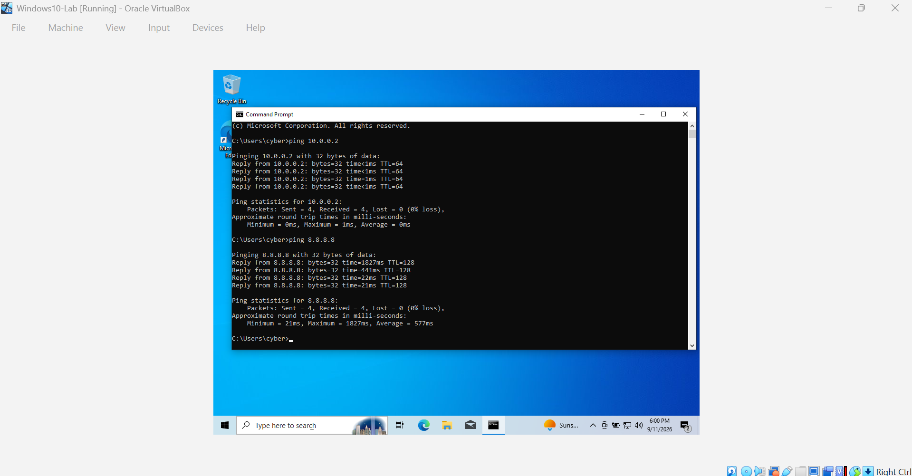
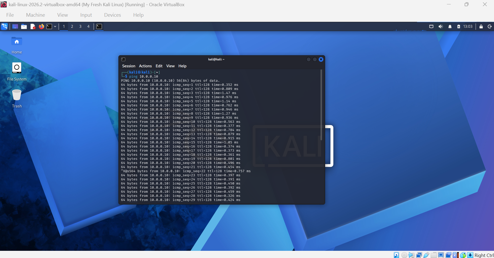

<div align="center">

# 💻 Windows 10 Virtual Machine Setup in VirtualBox

**Adding a Windows 10 target machine to the cybersecurity lab network**
</div>

<p align="center">
  
  
  
  
  
  
  
</p>

---

## 📌 Project Overview

This project extends my cybersecurity lab by adding a **Windows 10 virtual 
machine** to the same NAT Network already running my Kali Linux attacker machine.

The goal was to create a multi-machine environment where Kali and Windows 10 
can communicate with each other, giving me a realistic target to practise 
against in future penetration testing exercises.

---

## 🎯 Objectives

- Download the Windows 10 ISO from Microsoft's official source
- Create and configure a Windows 10 VM in VirtualBox
- Connect Windows 10 to the existing NatNetwork (10.0.0.0/24)
- Set a static IP address on the Windows 10 VM
- Verify two-way connectivity between Windows 10 and Kali Linux
- Take a clean snapshot for recovery

---

## ⚙️ Lab Configuration

## ⚙️ Lab Configuration

| 🧩 Component       | ⚙️ Configuration   |
| ------------------ | ------------------  |
| 🖥️ Host OS         | Windows 11         |
| 🧠 Host RAM        | 16 GB              |
| ⚡ Processor       | Intel Core i7      |
| 🧰 Hypervisor      | VirtualBox 7.2     |
| 🐉 Kali Linux IP   | 10.0.0.2/24        |
| 🪟 Windows 10 IP   | 10.0.0.10/24       |
| 🌐 Virtual Network | NAT Network        |
| 📡 Network Address | 10.0.0.0/24        |
| 🚪 Default Gateway | 10.0.0.1           |
| 🌍 DNS Server      | 8.8.8.8            |

---

## 🪜 Setup Procedure

### Step 1 — Download the Windows 10 ISO

Downloaded from Microsoft's official page using the Media Creation Tool.
Selected 64-bit ISO format for VirtualBox compatibility.

**Source:** https://www.microsoft.com/software-download/windows10

**Tip:** If Microsoft shows the Media Creation Tool instead of a direct 
ISO link, open the page in Chrome, press F12, enable responsive/mobile 
view, refresh, and a direct ISO download option should appear.

---

### Step 2 — Create the Windows 10 VM in VirtualBox

- Name: Windows10-Lab
- Type: Microsoft Windows
- Version: Windows 10 (64-bit)
- RAM: 4096 MB
- Storage: 40 GB dynamically allocated VDI

---

### Step 3 — Attach ISO and Install Windows

Attached the ISO under Settings > Storage, booted the VM, and worked 
through the Windows 10 setup. Skipped product key activation since this 
is a lab machine.



---

### Step 4 — Configure NAT Network

Set the Windows 10 VM network adapter to the same NatNetwork 
already used by Kali Linux.

- Settings > Network > Attached to: NAT Network
- Name: NatNetwork (same as Kali)

---

### Step 5 — Set a Static IP inside Windows 10

Configured via:
Control Panel > Network and Sharing Center > 
Change adapter settings > Ethernet > Properties > IPv4

```text
IP Address:    10.0.0.10
Subnet Mask:   255.255.255.0
Gateway:       10.0.0.1
DNS:           8.8.8.8
```



---

### Step 6 — Test Connectivity

```bash
# From Windows Command Prompt
ping 10.0.0.2       # Should reach Kali Linux
ping 8.8.8.8        # Should confirm internet access

# From Kali Linux Terminal
ping 10.0.0.10  # Should reach Windows 10
```




---

### Step 7 — Take a Clean Snapshot

Created a VirtualBox snapshot after successful configuration 
as a clean recovery baseline.

---

## 🔎 Connectivity Verification

| ✅ Test              | 🧾 Command          | 🎯 Result       |
|----------------------|----------------------|----------------- |
| Windows → Kali       | ping 10.0.0.2        | ✅ Successful   |
| Windows → Internet   | ping 8.8.8.8         | ✅ Successful   |
| Kali → Windows       | ping 10.0.0.10       | ✅ Successful   |

---

## 🐞 Problems Encountered & Solutions

### Problem 1 — Windows Setup Forced Microsoft Account Login

During installation, Windows 10 required a Microsoft account 
and asked for a personal email and phone number. I did not 
want to use personal credentials for a lab machine.

**Solution:** Temporarily disabled the VM's network adapter 
in VirtualBox (Settings > Network > uncheck Enable Network Adapter), 
restarted the VM, and Windows then offered a local account 
option. After setup completed, I re-enabled the network adapter 
and configured the static IP.

---

### Problem 2 — Windows Firewall Blocked Pings from Kali

When I ran `ping 10.0.0.10` from Kali, the terminal 
hung with no output. The ping was being silently dropped 
by the Windows Defender Firewall.

**Solution:** Inside the Windows 10 VM, opened Windows 
Defender Firewall and temporarily turned it off for both 
private and public networks. The Kali ping immediately 
started receiving successful replies with sub-millisecond 
response times.

---

## 💡 What I Learned

### 1. Local vs Microsoft Account During Windows Setup
Windows 10 pushes you hard toward a Microsoft account during 
installation. Disconnecting the network adapter is a clean 
workaround that forces a local account option, useful to 
know for any lab environment where you don't want personal 
credentials involved.

### 2. Windows Firewall Behaviour in a Lab
By default, Windows silently drops ICMP ping requests from 
external machines. This doesn't mean the network is broken, 
it means the firewall is doing its job. In a lab context, 
knowing the difference between a network issue and a 
firewall issue is an important diagnostic skill.

### 3. Multi-Machine Lab Networking
Getting two different operating systems, Kali Linux and 
Windows 10, talking to each other on the same virtual 
network is a significant step. This is the foundation 
for all future penetration testing exercises.

---

## 🔐 Security & Ethical Use

This laboratory is intended strictly for educational purposes only.

---

## 🔗 Tools & Resources

- **VirtualBox:** https://virtualbox.org/wiki/Downloads
- **Windows 10 ISO:** https://www.microsoft.com/software-download/windows10

---

## 👤 Author

**David Awodiran**  
Cybersecurity Professional B083

LinkedIn: https://www.linkedin.com/in/davidawodiran/

---

## 📌 Project Information

**Program Name:** Cybersecurity at Networkwalks | **Week:** 01 | 
**Extra Project:** Windows 10 VM Setup | **Repository:** GitHub
